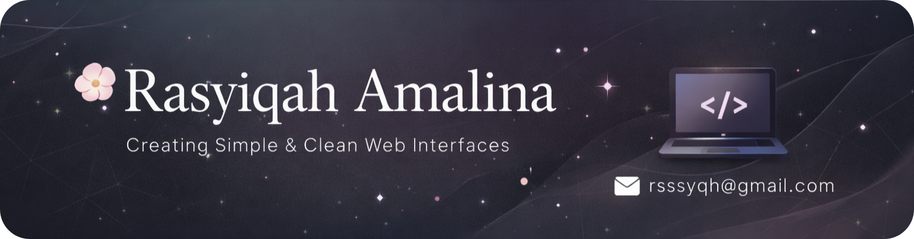

  

## 🌿 About Me

🎓 Informatics student at Universitas Sumatera Utara  
💻 Currently learning Frontend Web Development  
🌱 Focusing on HTML, CSS, JavaScript, PHP, and Laravel  
🎨 Interested in clean and user-friendly interfaces  
📚 Learning by building small projects  

---

  

---

## 🧰 My Toolkit

### Programming & Markup ✨

  

### Tools ✨

  

---

## 📊 GitHub Analytics

  
  
  

  

 
